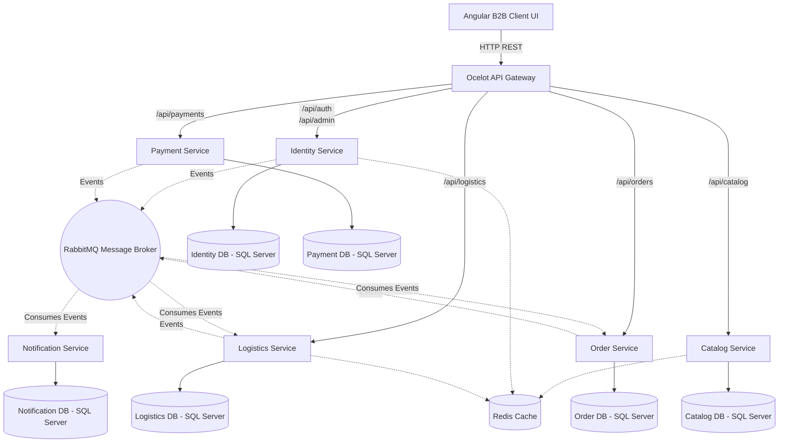

# Part 1: System Architecture Overview

## 1. Executive Summary

The Coca-Cola Enterprise B2B Supply Chain Platform is designed as a highly scalable, event-driven, microservices-based system. It targets B2B operational needs, enabling Coca-Cola dealers and distributors to place bulk orders, track logistics and shipments in real time, and process seamless online transactions.

The system is decomposed into highly specialized, isolated bounded contexts using Domain-Driven Design (DDD) principles. This ensures that services can independently scale, deploy, and evolve without affecting the rest of the ecosystem.

## 2. Technology Stack

The platform incorporates a modern, enterprise-grade technology stack:

- **Frontend:** Angular 17 (Typescript) standalone components, leveraging RxJS for reactive programming and TailwindCSS for responsive design.
- **API Gateway:** Ocelot API Gateway running on .NET 8, acting as a single entry point for all client requests.
- **Backend Microservices:** .NET 8 ASP.NET Core Web API.
- **Architecture Pattern:** CQRS (Command Query Responsibility Segregation) via MediatR, and Hexagonal Architecture (Ports and Adapters).
- **Communication (Synchronous):** RESTful HTTP APIs.
- **Communication (Asynchronous):** RabbitMQ with MassTransit for event publishing and subscribing (Pub/Sub pattern).
- **Databases:** Relational Data stored in Microsoft SQL Server 2022 (One isolated database per microservice).
- **Caching & Distributed Locks:** Redis 7.4.
- **Background Jobs:** Hangfire for background processing.
- **Authentication:** JWT (JSON Web Tokens) with Role-Based Access Control (Admin, Dealer, SuperAdmin).
- **Payment Gateway:** Razorpay.
- **Containerization & Orchestration:** Docker and Docker Compose.

---

## 3. High-Level Architecture Diagram

## 4. Key Architectural Decisions

1. **Database-per-Microservice Pattern:** Each microservice has its own isolated Microsoft SQL Server database. This enforces loose coupling; if the `OrderDb` falls over, users can still log in and view the catalog. Data crossing bounded contexts is propagated via asynchronous integration events over RabbitMQ.
2. **CQRS with MediatR:** Operations within microservices are strictly segregated into Commands (state-changing, e.g., `PlaceOrderCommand`) and Queries (read-only, e.g., `GetCatalogItemsQuery`). This abstraction makes business handlers highly testable and explicitly defines use-case boundaries.
3. **Event-Driven Chaining:** Rather than synchronous HTTP calls causing cascading failures, actions like payment successes emit a `PaymentConfirmedEvent`. The `OrderService` listens to this event to update the order status to `Paid`, and emits an `OrderReadyForDispatchEvent`. The `LogisticsService` listens to this to assign a delivery agent.
4. **Ocelot API Gateway:** Consolidates multiple microservice endpoints into a unified API surface (`localhost:5050`). Ocelot inherently abstracts the internal networking (e.g., routing `/api/auth/{everything}` strictly to the Identity Service).
