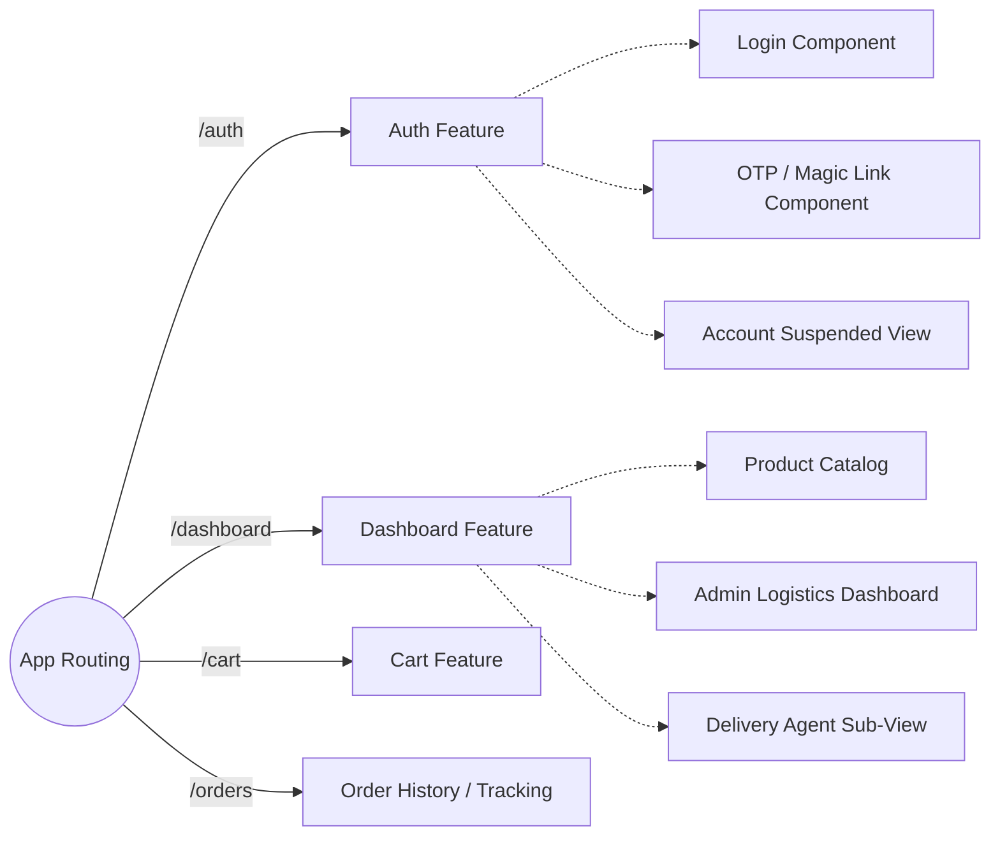

# Part 2: Frontend Architecture

## 1. Overview

The front-end client interface for the Coca-Cola B2B Supply Chain Platform is built using **Angular 17**, taking full advantage of modern Angular concepts like **Standalone Components** (eliminating the need for large NgModules) and **Signals** / Reactive programming with **RxJS**. 

The UI provides a dashboard for tracking orders, managing cart items, viewing catalog products, handling the approval lifecycle for dealers, and checking out seamlessly using Razorpay integration. It is visually stylized using **TailwindCSS** to provide a dynamic, modern, responsive look.

## 2. Core Structure & Routing

The application relies heavily on **Lazy Loading** to optimize initial load payloads. Routes are partitioned logically based on domain modules:

### Module Responsibilities:
- **Auth Subsystem:** Handles JWT persistence, registration, email-based magic-link OTP generation, and dealer suspended/onboarding screens.
- **Catalog/Dashboard Subsystem:** Pulls product items from the Catalog Service. Incorporates searching, sorting, and pagination logic on the client side.
- **Cart/Checkout Subsystem:** Accumulates order line items, calculates gross totals and taxes locally (which are verified server-side), validates inventory, and triggers checkout.
- **Razorpay Integration:** A dedicated overlay handling the Razorpay iFrame injected via `window.Razorpay()`.

## 3. Communication & Interceptors

All HTTP requests dispatched from the Angular frontend pass through critical **HTTP Interceptors**:

1. **`JwtInterceptor`:** Automatically extracts the JWT access token from LocalStorage/SessionStorage and attaches it as an `Authorization: Bearer <token>` header to outgoing API requests targeting the `localhost:5050` gateway.
2. **`ErrorInterceptor`:** Globally catches HTTP error codes (Wait, 401 Unauthorized, 403 Forbidden, 5xx Server Errors). If a 401 is caught and the token is expired, it automatically halts the queue, pings the `/api/auth/refresh` endpoint to retrieve a new rolling token, replaces it, and replays the original failed requests. If it receives a hard rejection (Account Suspended), it redirects to the `/auth/account-suspended` route.

## 4. State Management

Due to the streamlined nature of the application domains (primarily server-dependent CRUD workflows), state management is handled natively via **RxJS BehaviorSubjects** exposed through dedicated Angular Services (`CartService`, `AuthService`, `LogisticsService`).

- **Example Use Case (`CartService`):**
  When a user invokes `addToCart(item)`, the `CartService` publishes the updated cart state to a `BehaviorSubject`. The global Header component, which listens to this observable, reacts automatically by updating the shopping cart badge count in real time without causing unnecessary DOM re-renders elsewhere.

## 5. Build and Containerization

The Angular application is encapsulated within a multi-stage Docker build:
1. **Stage 1 (Node Build):** Installs `npm` dependencies, compiles SCSS into CSS, resolves Ahead-of-Time (AOT) compilation, and constructs the optimized production bundle.
2. **Stage 2 (Nginx Runtime):** Injects the static output into an Alpine Nginx container. `nginx.conf` is heavily optimized to compress static assets (gzip/Brotli) and enforce SPA fallback routing (`try_files $uri $uri/ /index.html;`) so that direct URL navigation bypasses 404 Nginx errors.
