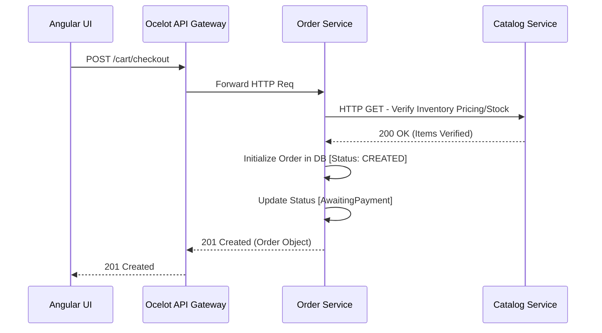

# Part 4: Core Workflows

## 1. Authentication & Onboarding Lifecycle

The Coca-Cola B2B platform restricts unverified buyers from placing bulk orders. 

1. **Dealer Registration:** A new candidate dealer fills out the onboarding application on Angular. This sends a `RegisterDealerCommand` to the Identity Service. A magic link/OTP is dispatched via the Notification Service for email verification.
2. **Approval Gate:** The dealer's email is verified, but the account is injected into the SQL Database with a `Status = PendingApproval`. They cannot log in yet.
3. **Admin Intervention:** A SuperAdmin navigates to the Admin Dashboard, views pending dealers, and initiates an `ApproveDealerCommand`. The Identity DB updates the dealer to `Status = Active`.
4. **Login:** Dealer inputs email and password. Identity Service returns a signed JWT containing their `role` and `dealerId`. The Angular client stores this and affixes it to all subsequent API calls.

## 2. Order Placement & State Machine Flow

The heart of the supply chain revolves around moving stock from a Catalog into a Finalized Order.

## 3. Financial Transaction via Razorpay

Because Order Service and Payment Service are isolated, establishing financial finality involves both asynchronous UI handshakes and Server-to-Server callbacks.

1. **Invoke Intent:** Following the Order placement, Angular pings the Payment Service to establish an intent. Payment Service connects to Razorpay API using API Keys and generates a native Razorpay `OrderId`.
2. **UI Interruption:** Angular captures the Razorpay `OrderId` and mounts the `window.Razorpay` external pop-up modal. The dealer inputs test card credentials.
3. **Verification:**
   - **Happy Path:** Razorpay triggers the `payment.captured` Webhook pointing to `Payment Service`. The service validates the `XHmacSignature` to ensure the payload wasn't intercepted.
   - **Transaction Locking:** The Payment Service commits the record to `CocaCola_PaymentDb`.
4. **Event Firing:** Payment Service drops a `PaymentConfirmedIntegrationEvent` onto RabbitMQ.
5. **Listener Consumption:** Order Service, sitting idle, inhales the event, cross-references its own internal Order ID, and legally updates the Order State to `Paid` and immediately cascades an `OrderReadyForDispatchEvent`.

## 4. Logistics Execution

Once the `OrderReadyForDispatchEvent` propagates from the Order Service, the lifecycle transitions locally to the logistics domain.

1. **Ingestion:** Logistics Service consumes the dispatch event. It creates a local `Shipment` aggregate root mapped back to the origin `OrderId`.
2. **Agent Pooling:** The system (assisted by Hangfire polling) runs algorithms to select an available delivery agent based on capacity constraints.
3. **Agent Assignment:** The Shipment status updates from `Pending` -> `Assigned`. A `ShipmentAssignedEvent` is broadcasted.
4. **Notification:** The Notification Service catches the `ShipmentAssignedEvent` and pings the customer with their tracking details.
5. **Fulfillment:** The delivery agent (using their sub-view in the UI) toggles the order to `Delivered`. Logistics Service completes the record and triggers `ShipmentDeliveredEvent`, completing the order life-cycle permanently across all bound contexts.
