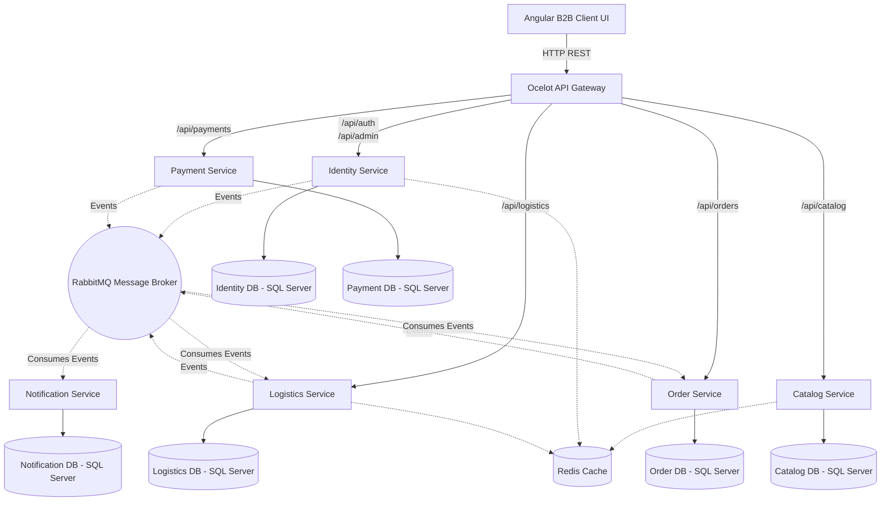
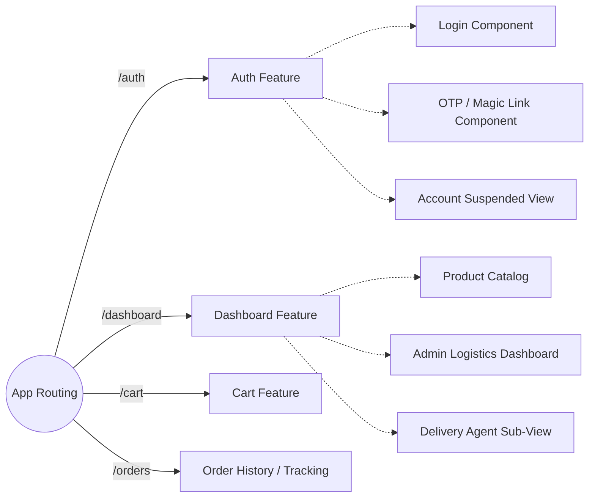
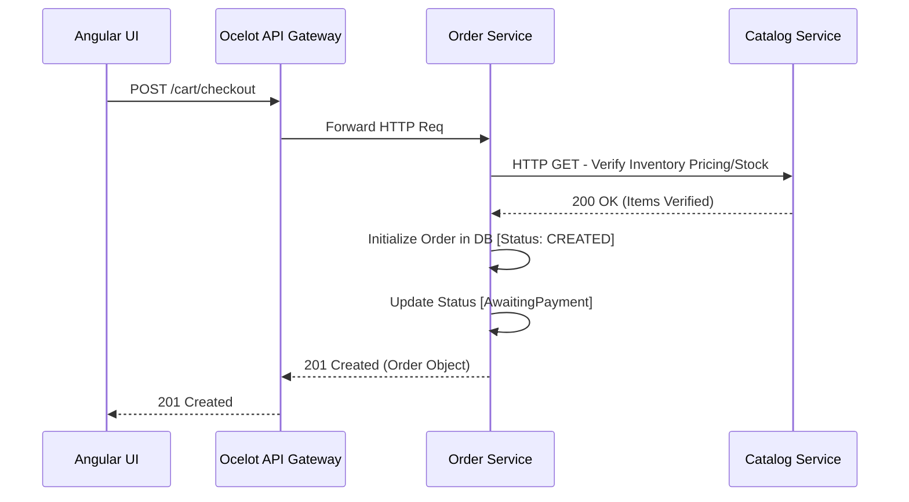

# Part 1: System Architecture Overview

## 1. Executive Summary

The Coca-Cola Enterprise B2B Supply Chain Platform is designed as a highly scalable, event-driven, microservices-based system. It targets B2B operational needs, enabling Coca-Cola dealers and distributors to place bulk orders, track logistics and shipments in real time, and process seamless online transactions.

The system is decomposed into highly specialized, isolated bounded contexts using Domain-Driven Design (DDD) principles. This ensures that services can independently scale, deploy, and evolve without affecting the rest of the ecosystem.

## 2. Technology Stack

The platform incorporates a modern, enterprise-grade technology stack:

- **Frontend:** Angular 17 (Typescript) standalone components, leveraging RxJS for reactive programming and TailwindCSS for responsive design.
- **API Gateway:** Ocelot API Gateway running on .NET 8, acting as a single entry point for all client requests.
- **Backend Microservices:** .NET 8 ASP.NET Core Web API.
- **Architecture Pattern:** CQRS (Command Query Responsibility Segregation) via MediatR, and Hexagonal Architecture (Ports and Adapters).
- **Communication (Synchronous):** RESTful HTTP APIs.
- **Communication (Asynchronous):** RabbitMQ with MassTransit for event publishing and subscribing (Pub/Sub pattern).
- **Databases:** Relational Data stored in Microsoft SQL Server 2022 (One isolated database per microservice).
- **Caching & Distributed Locks:** Redis 7.4.
- **Background Jobs:** Hangfire for background processing.
- **Authentication:** JWT (JSON Web Tokens) with Role-Based Access Control (Admin, Dealer, SuperAdmin).
- **Payment Gateway:** Razorpay.
- **Containerization & Orchestration:** Docker and Docker Compose.

---

## 3. High-Level Architecture Diagram

## 4. Key Architectural Decisions

1. **Database-per-Microservice Pattern:** Each microservice has its own isolated Microsoft SQL Server database. This enforces loose coupling; if the `OrderDb` falls over, users can still log in and view the catalog. Data crossing bounded contexts is propagated via asynchronous integration events over RabbitMQ.
2. **CQRS with MediatR:** Operations within microservices are strictly segregated into Commands (state-changing, e.g., `PlaceOrderCommand`) and Queries (read-only, e.g., `GetCatalogItemsQuery`). This abstraction makes business handlers highly testable and explicitly defines use-case boundaries.
3. **Event-Driven Chaining:** Rather than synchronous HTTP calls causing cascading failures, actions like payment successes emit a `PaymentConfirmedEvent`. The `OrderService` listens to this event to update the order status to `Paid`, and emits an `OrderReadyForDispatchEvent`. The `LogisticsService` listens to this to assign a delivery agent.
4. **Ocelot API Gateway:** Consolidates multiple microservice endpoints into a unified API surface (`localhost:5050`). Ocelot inherently abstracts the internal networking (e.g., routing `/api/auth/{everything}` strictly to the Identity Service).

# Part 2: Frontend Architecture

## 1. Overview

The front-end client interface for the Coca-Cola B2B Supply Chain Platform is built using **Angular 17**, taking full advantage of modern Angular concepts like **Standalone Components** (eliminating the need for large NgModules) and **Signals** / Reactive programming with **RxJS**. 

The UI provides a dashboard for tracking orders, managing cart items, viewing catalog products, handling the approval lifecycle for dealers, and checking out seamlessly using Razorpay integration. It is visually stylized using **TailwindCSS** to provide a dynamic, modern, responsive look.

## 2. Core Structure & Routing

The application relies heavily on **Lazy Loading** to optimize initial load payloads. Routes are partitioned logically based on domain modules:

### Module Responsibilities:
- **Auth Subsystem:** Handles JWT persistence, registration, email-based magic-link OTP generation, and dealer suspended/onboarding screens.
- **Catalog/Dashboard Subsystem:** Pulls product items from the Catalog Service. Incorporates searching, sorting, and pagination logic on the client side.
- **Cart/Checkout Subsystem:** Accumulates order line items, calculates gross totals and taxes locally (which are verified server-side), validates inventory, and triggers checkout.
- **Razorpay Integration:** A dedicated overlay handling the Razorpay iFrame injected via `window.Razorpay()`.

## 3. Communication & Interceptors

All HTTP requests dispatched from the Angular frontend pass through critical **HTTP Interceptors**:

1. **`JwtInterceptor`:** Automatically extracts the JWT access token from LocalStorage/SessionStorage and attaches it as an `Authorization: Bearer <token>` header to outgoing API requests targeting the `localhost:5050` gateway.
2. **`ErrorInterceptor`:** Globally catches HTTP error codes (Wait, 401 Unauthorized, 403 Forbidden, 5xx Server Errors). If a 401 is caught and the token is expired, it automatically halts the queue, pings the `/api/auth/refresh` endpoint to retrieve a new rolling token, replaces it, and replays the original failed requests. If it receives a hard rejection (Account Suspended), it redirects to the `/auth/account-suspended` route.

## 4. State Management

Due to the streamlined nature of the application domains (primarily server-dependent CRUD workflows), state management is handled natively via **RxJS BehaviorSubjects** exposed through dedicated Angular Services (`CartService`, `AuthService`, `LogisticsService`).

- **Example Use Case (`CartService`):**
  When a user invokes `addToCart(item)`, the `CartService` publishes the updated cart state to a `BehaviorSubject`. The global Header component, which listens to this observable, reacts automatically by updating the shopping cart badge count in real time without causing unnecessary DOM re-renders elsewhere.

## 5. Build and Containerization

The Angular application is encapsulated within a multi-stage Docker build:
1. **Stage 1 (Node Build):** Installs `npm` dependencies, compiles SCSS into CSS, resolves Ahead-of-Time (AOT) compilation, and constructs the optimized production bundle.
2. **Stage 2 (Nginx Runtime):** Injects the static output into an Alpine Nginx container. `nginx.conf` is heavily optimized to compress static assets (gzip/Brotli) and enforce SPA fallback routing (`try_files $uri $uri/ /index.html;`) so that direct URL navigation bypasses 404 Nginx errors.

# Part 3: Backend Microservices Deep Dive

## 1. Domain Organization

The backend system implements **Domain-Driven Design (DDD)**. Across all 6 microservices, project structures generally conform to a standard Clean Architecture / Onion Architecture paradigm comprising four primary layers:
1. **API / Presentation Layer:** Contains controllers filtering HTTP transit and MediatR configuration. 
2. **Application Layer:** Contains MediatR Commands/Queries, Validators (FluentValidation), ViewModels/DTOs, and application logic.
3. **Domain Layer:** Contains core business entities (Aggregates), Value Objects, Enums, and Repository abstractions.
4. **Infrastructure Layer:** Houses Entity Framework Core DbContexts, raw Data Access, RabbitMQ Consumers, external SMTP or Razorpay integrations.

## 2. Identity Service
**Port: 5002** | **Database:** `CocaCola_IdentityDb` 

**Responsibility:** The exclusive holder of user credentials, authentication logic, and dealer lifecycle. 
- **Roles Implemented:** SuperAdmin (platform owner), Dealer (business customer).
- **Core Feature:** Dealers register through a Magic Link/OTP workflow. New accounts start as `PendingApproval`. SuperAdmins use the `ApproveDealerCommand` to escalate them to an active state. 
- **Token Handling:** Implements JWT Bearer authentication issuing tokens containing User IDs and Roles, granting authorization downstream.

## 3. Catalog Service
**Port: 5004** | **Database:** `CocaCola_CatalogDb`

**Responsibility:** Manages all Coca-Cola product SKUs, pricing structures, and inventory details available for wholesale.
- **Data Caching:** Product retrieval requests (`GET /api/catalog/items`) aggressively utilize **Redis**. Catalog updates (e.g., changing the price of Diet Coke) emit cache-invalidation commands.
- **Inventory Check:** Exposes internal endpoints requested strictly by the Order service to validate if an intended cart quantity exceeds actual physical stock before locking in a purchase.

## 4. Order Service
**Port: 5006** | **Database:** `CocaCola_OrderDb`

**Responsibility:** Manages cart construction, order origination, and the central Order State Machine.
- **State Machine Transitions:** `Created` -> `AwaitingPayment` -> `Paid` -> `ReadyForDispatch` -> `Assigned` -> `InTransit` -> `Delivered`.
- **Saga Participation:** Upon order completion at checkout, an order is locked in as `Created` and immediately transitioned to `AwaitingPayment`. It stays here until RabbitMQ issues an event from the Payment Service confirming funding.

## 5. Payment Service
**Port: 5010** | **Database:** `CocaCola_PaymentDb`

**Responsibility:** Interfaces with external financial gateways (specifically Razorpay).
- **Flow:** When a dealer finishes checking out, the Payment service issues a Razorpay `Order_Id`. The frontend executes the payment. 
- **Webhook Subsystem:** Securely captures Razorpay webhooks (`payment.captured`). Validates HMAC signatures sequentially, and upon verification, emits the `PaymentCompletedIntegrationEvent` to the RabbitMQ bus. 
- **Resilience:** Integrates Polly retry policies (WaitAndRetry) in case the Order Service cannot be reached to acknowledge successful payments immediately.

## 6. Logistics Service
**Port: 5008** | **Database:** `CocaCola_LogisticsDb`

**Responsibility:** Manages delivery fleets, tracks location, handles geographical dispatch logistics, and updates the final order state to `Delivered`.
- **Event Hook:** Listens to `OrderReadyForDispatchEvent` (triggered after payment).
- **Agent Assignment:** Handles the pooling of delivery drivers. An internal mechanism connects available agents to pending shipments. 
- **Background Jobs:** Utilizes **Hangfire** dashboards linked to SQL Server storage to enqueue and retry unassigned logistic queues until an agent takes the dispatch ticket.

## 7. Notification Service
**Port: 5012** | **Database:** `CocaCola_NotificationDb`

**Responsibility:** Fully decoupled alert engine. 
- **Event Consuming:** Subscribes blindly to a myriad of events across the mesh: `DealerApprovedIntegrationEvent`, `OrderConfirmedIntegrationEvent`, `DeliveryDispatchedIntegrationEvent`.
- **Infrastructure:** Maps event payloads to rich HTML templates and drops them into a `SmtpClient` queue targeting Gmail. 

---

### Internal Communication (Gateway & Proxies)
Direct internal synchronous communication (where absolutely critical, e.g. Payment querying Order details) is routed via `IHttpClientFactory` typed clients resolving service names dictated by Docker Compose network bridges (e.g., `http://order-service:8080`). However, state mutations explicitly enforce pure asynchronous Pub/Sub communication to prevent cyclic HTTP timeouts.

# Part 4: Core Workflows

## 1. Authentication & Onboarding Lifecycle

The Coca-Cola B2B platform restricts unverified buyers from placing bulk orders. 

1. **Dealer Registration:** A new candidate dealer fills out the onboarding application on Angular. This sends a `RegisterDealerCommand` to the Identity Service. A magic link/OTP is dispatched via the Notification Service for email verification.
2. **Approval Gate:** The dealer's email is verified, but the account is injected into the SQL Database with a `Status = PendingApproval`. They cannot log in yet.
3. **Admin Intervention:** A SuperAdmin navigates to the Admin Dashboard, views pending dealers, and initiates an `ApproveDealerCommand`. The Identity DB updates the dealer to `Status = Active`.
4. **Login:** Dealer inputs email and password. Identity Service returns a signed JWT containing their `role` and `dealerId`. The Angular client stores this and affixes it to all subsequent API calls.

## 2. Order Placement & State Machine Flow

The heart of the supply chain revolves around moving stock from a Catalog into a Finalized Order.

## 3. Financial Transaction via Razorpay

Because Order Service and Payment Service are isolated, establishing financial finality involves both asynchronous UI handshakes and Server-to-Server callbacks.

1. **Invoke Intent:** Following the Order placement, Angular pings the Payment Service to establish an intent. Payment Service connects to Razorpay API using API Keys and generates a native Razorpay `OrderId`.
2. **UI Interruption:** Angular captures the Razorpay `OrderId` and mounts the `window.Razorpay` external pop-up modal. The dealer inputs test card credentials.
3. **Verification:**
   - **Happy Path:** Razorpay triggers the `payment.captured` Webhook pointing to `Payment Service`. The service validates the `XHmacSignature` to ensure the payload wasn't intercepted.
   - **Transaction Locking:** The Payment Service commits the record to `CocaCola_PaymentDb`.
4. **Event Firing:** Payment Service drops a `PaymentConfirmedIntegrationEvent` onto RabbitMQ.
5. **Listener Consumption:** Order Service, sitting idle, inhales the event, cross-references its own internal Order ID, and legally updates the Order State to `Paid` and immediately cascades an `OrderReadyForDispatchEvent`.

## 4. Logistics Execution

Once the `OrderReadyForDispatchEvent` propagates from the Order Service, the lifecycle transitions locally to the logistics domain.

1. **Ingestion:** Logistics Service consumes the dispatch event. It creates a local `Shipment` aggregate root mapped back to the origin `OrderId`.
2. **Agent Pooling:** The system (assisted by Hangfire polling) runs algorithms to select an available delivery agent based on capacity constraints.
3. **Agent Assignment:** The Shipment status updates from `Pending` -> `Assigned`. A `ShipmentAssignedEvent` is broadcasted.
4. **Notification:** The Notification Service catches the `ShipmentAssignedEvent` and pings the customer with their tracking details.
5. **Fulfillment:** The delivery agent (using their sub-view in the UI) toggles the order to `Delivered`. Logistics Service completes the record and triggers `ShipmentDeliveredEvent`, completing the order life-cycle permanently across all bound contexts.
